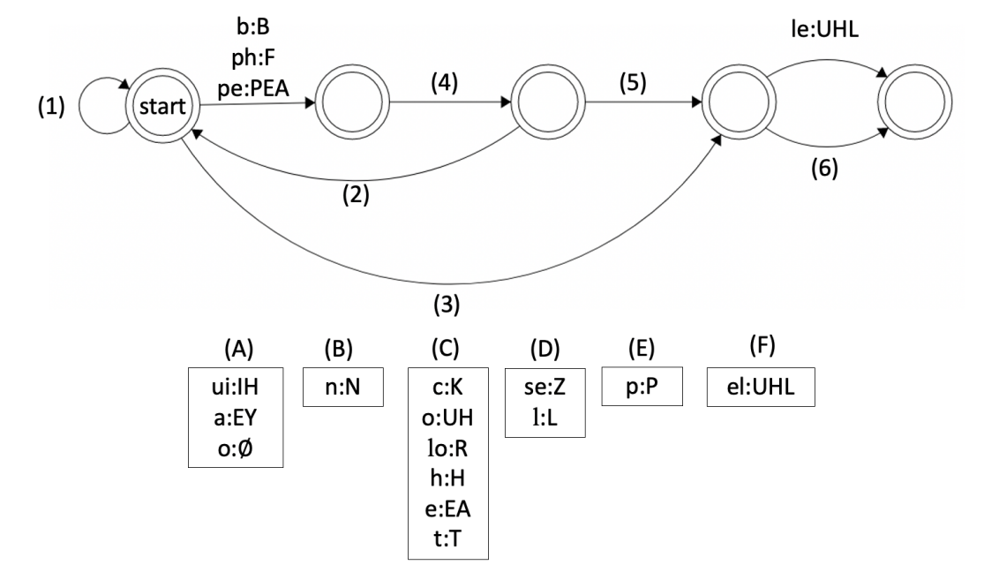

Many types of technology have to convert writing to sounds, a process known as text to speech. For
example, a GPS needs to read street names to the person driving the car, and virtual assistants (such as Siri
or Alexa) may need to read text from a webpage. An important step in this process is grapheme-to-phoneme
conversion: changing a sequence of graphemes (the basic units of writing, such as letters) to a sequence of
phonemes (the basic units of speech).

In this problem, we will study finite-state transducers (FSTs), one type of system that can perform graphemeto-phoneme conversion. Below is an example of an FST:

The FST takes in a sequence of letters (in lowercase, before the colons) and outputs a sequence of sounds (in
uppercase, after the colons). The FST starts at the circle labeled “start.” When it reads in some lowercase
letter(s), it follows the arrow marked with the letter(s) and also outputs the phoneme(s) associated with the
letter(s), until the entire input has been used up. For example, given the input “siding,” the system would
produce SAYDIHNG. Ø is a special symbol which means that no output is produced: for the input “side”, the
output is SAYD. We need to represent letters and sounds differently from each other because letters can be
pronounced differently in different words. For example, the letters ed can be pronounced D (as in “timed”)
or UHD (as in “sided”).

**L1.** What output would the system produce for the following words?
> (a) time :ans (b) traded :ans 
>
> (c) striding :ans (d) framing :ans

**L2.** Sometimes, when the system reads in a letter, there are two possible paths that it could follow. In such
cases, it tries one path and then, if it gets stuck, it backtracks (goes back) and tries a different path until it
finds one that works – somewhat like how you might solve a maze[^1].
Exactly one of the following three words
could potentially force the system to backtrack – which word is it? Answer on your Answer Sheet.

> fading, stage, name :ans

**L3.** A path is only valid if it ends at a position with a double circle. With this fact in mind, what output would
the system on the previous page produce for the following inputs?
> (a) staging :ans
> (b) gaming :ans

**L4.** Many English words are spelled very strangely. For example, “colonel” is pronounced KUHRNUHL (like
“kernel”) — there is an R in the pronunciation even though there is no r in the spelling! The FST below is
designed to handle some of these exceptions. Match the arrows ((1)-(6)) with their labels ((A)-(F)) so that the
system gives the correct outputs for the 5 words listed under the FST.

| Spelling | Pronunciation |
| - | - |
| colonel | KUHRNUHL |
| he | HEA |
| people | PEAPUHL |
| phase | FEYZ |
| built | BIHLT |

> 1. :ans 2. :ans 3. :ans
> 4. :ans 5. :ans 6. :ans

**L5.** When using an FST, it is possible to swap what counts as the input vs. the output. In our case, this means
that we can provide a sequence of sounds (the symbols to the right of the colons) and have the system
produce letters (the symbols to the left of the colons). Since the system is converting sounds into spelling,
this process is something like having the system compete in a spelling bee. When you are using the previous
FST (the one that handles “colonel”), you try asking it what sequence of letters would be pronounced
RUHFLEA. You expect its answer to be “roughly”, but instead you get something very different! What
sequence of letters does the system say would be pronounced RUHFLEA?

> :ans{.large}

[^1]: It is possible to create an FST that gives more than one output for a given input. However, for all cases used in this contest, a
given input will have at most one output. 