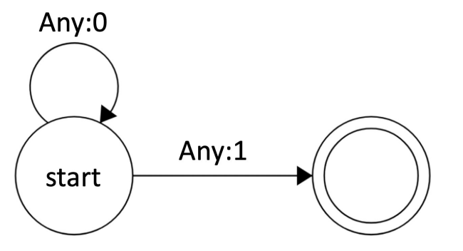

*Note: This problem builds upon the previous problem, [(L) Stopping for a Spell](./l), so we recommend solving that
one first. There are parts of this problem that you may not be able to solve unless you have first completed (L)
Stopping for a Spell.*

Thai, the official language of Thailand and a member of the Kra-Dai family, uses a writing system derived
from the Old Khmer script. Unlike in English, in Thai writing there are no spaces between words. Thus, Thai
**word segmentation** — the task of breaking a piece of Thai text into words — is a complex problem in
computational linguistics.

Pavan and Arun are both computer scientists who are trying to develop a word segmentation model for Thai.
To evaluate the performance of their model, they use the F1-score which is calculated using the following
equation:

$$F_1=\frac{TP}{TP+\frac{1}{2}(FP+FN)}$$

TP represents the number of true positives, FP represents the number of false positives, and FN represents
the number of false negatives. A true positive is a case where the correct answer is a positive label, and the
model returns a positive label; a false positive is a case where the correct answer is a negative label, but the
model returns a positive label; and a false negative is a case where the correct answer is a positive label, but
the model returns a negative label.

In order to segment a piece of Thai text into words, Pavan and Arun’s models take in the Thai text and assign
a label to each character in the text. Specifically, the label should be 1 if the character is the end of a word,
or 0 otherwise. As an example, consider the following sentence:

เวลาเท่าไหร่แล้ว? (“What is the time?”)

This sentence has 4 words (counting the question mark as a “word”), which we can separate using vertical
bars:

เวลา | เท่าไหร่ | แล้ว | ? |

We can further break the sentence into 13 characters. Some characters contain a dotted circle, indicating
that the character combines with some other character that goes in the place of the dotted circle:

[เ,ว,ล,า,เ,ท,◌่,า,ไ,ห,ร,◌่,แ,ล,◌้,ว,?]

Based on the word boundaries indicated before, a perfect word segmentation output would be:

[0,0,0,1,0,0,0,0,0,0,0,1,0,0,0,1,1]

Initially, Pavan and Arun develop a simple baseline approach. Soon, they learn a bit more about the Thai
writing system. Based on this knowledge, they group Thai characters into several groups: They label some as
vowels (listed as Vowel at the end of the problem), some as consonants that can appear at the start of a
syllable (listed as Initial consonant at the end of the problem), and some as consonants that can appear at
the end of a syllable (listed as Final consonant at the end of the problem). Note that some characters appear
in more than one category. Using these categories, Pavan and Arun each develop a new algorithm. All three
of these algorithms are described below:

**Baseline algorithm:**
- Label the last character of the sentence with a 1.
- Label all other characters with a 0.

**Pavan’s algorithm:**
- For all characters that appear in the Final consonant list at the end of the problem, label them with a 1.
- Label the last character of the sentence with a 1.
- Label all other characters with a 0.
Arun’s algorithm:
- Assign a label of 1 to all characters that satisfy the following criteria:
	- The character is in the Final consonant list
	- The character is preceded by a Vowel
	- The character is followed by an Initial consonant and then a Vowel
	- (In other words, use the label of 1 for a character that fits the FC slot in the following template: V
FC IC V).
- Label the last character of the sentence with a 1.
- Label all other characters with a 0.

On the next page are 3 Thai sentences along with the F1-score that each algorithm achieves on each
sentence. Unfortunately, Pavan and Arun have lost track of which algorithm is which! 

**M1.** Match each algorithm name from the previous page (“Baseline algorithm”, “Pavan’s algorithm”, or
“Arun’s algorithm”) to its label in the table (“Alg A” to “Alg C”). Answer on your Answer Sheet.

| Thai sentence (with word boundaries added) | Character array | F1: Alg A | F1: Alg B | F1: Alg C |
| - | - | - | - | - |
| ฉัน \| จะ \| พบ \| เขา \| ใน \| วันพรุ่งนี้ \|   “I will meet him tomorrow.” | [ฉ,◌ั,น,จ,ะ,พ,บ,เ,ข,า,ใ,น,ว,◌ั,น,พ,ร, ◌ุ, ◌่,ง,น,◌ี,◌้] | 0.29 | 0.60 | 0.42 |
| เขา \| ให้ \| ของขวัญ \| ฉัน \|   “He gave me a present.” | [เ,ข,า,ใ,ห,◌้,ข,อ,ง,ข,ว,◌ั,ญ,ฉ,◌ั,น]| 0.40 | 0.67 | 0.36 |
| ฉัน \| พูด \| ภาษาไทย \|   “I speak Thai.” |[ฉ,◌ั,น,พู,◌ู,ด,ภ,า,ษ,า,ไ,ท,ย] | 0.50 | 1.00 | 0.60 |

> Baseline algorithm: :ans
>
> Pavan's algorithm: :ans
>
> Arun's algorithm: :ans

One challenge for Thai word segmentation is that often there is no single right answer: There can be multiple
valid ways to break a Thai sentence into words. For example, consider the 4 Thai lines below. In the final
example of the table above, example (1) is treated as a single word (meaning “Thai”). However, it is also
valid to treat this as two words, listed in examples (2) and (3). If we use this view, then the final sentence
would be segmented as shown in example (4).
1. ภาษาไทย “Thai” 
2. ภาษา “language”
3. ไทย “Thai”
4. ฉัน \| พูด \| ภาษา \| ไทย \|

**M2.** What F1-score would Arun’s algorithm get in the last row of the table above if we used (4) as the
intended segmentation, rather than the segmentation shown in the table? If you want, you can leave your
answer as a fraction — e.g., 19.4/51.7 — rather than simplifying it into a decimal. 
> :ans

Here is a finite-state transducer that implements the Baseline Algorithm:

**M3.** Draw **(a)** a finite-state transducer that implements Pavan’s Algorithm and **(b)** a finite-state transducer
that implements Arun’s Algorithm. (See the previous problem, (L), for a definition of finite-state
transducers.) It may be helpful to use the category labels listed below; in an FST, one of these category labels
can match any character that is a member of that category. For example, in the transducer above, we have
used Any to match any single character. If you wish, you can abbreviate these terms — just make sure to
include a key for any abbreviations.

**List of character categories:**
- *Punctuation*: ?
- *Tone*: ◌่, ◌้
- *Vowel*: ◌ั, ◌ู, ◌ี, า, ไ, ใ, ย, เ, แ, ะ, ◌ุ, อ
- *Initial consonant*: น,พ,ด,ภ,ท,ษ,ว,ล,ร,จ,บ,ข,ง,ญ,ฉ,ห
- *Final consonant*: น,พ,ด,ภ,ท,ษ,ว,ล,ร,จ,บ,ข,ง,ญ
- *Any*: Can match any character from any of the 5 categories above
- *Not [CATEGORY]*: Can match any character that does not belong to the category [CATEGORY], where
[CATEGORY] can be replaced with any of the category names above (Punctuation, Tone, Vowel, etc.). For
example, *Not Vowel* would mean any character that is not one of the vowels.